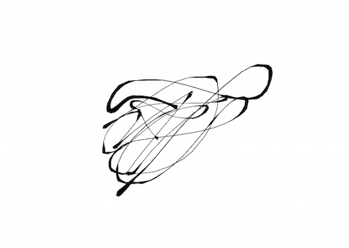
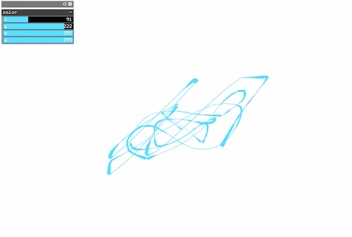
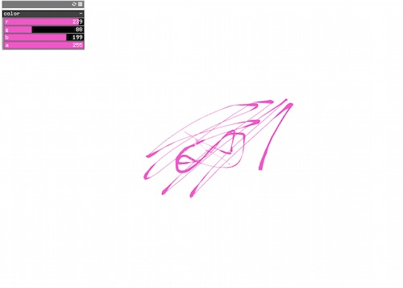
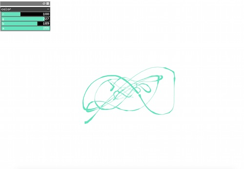

## Working with Gui

This project combines the openFrameworks Camera Ribbon Example and Gui Example in order to experiment with integrating multiple pieces of code and explore working with Gui. With the use of color from the Gui Example, the project acts more like a drawing application with limitless colors of paint.

Below is the Camera Ribbon Example before integrating the Gui example:

After integrating the Gui example, there is a color slider that can be used to change the color while the program is running:

